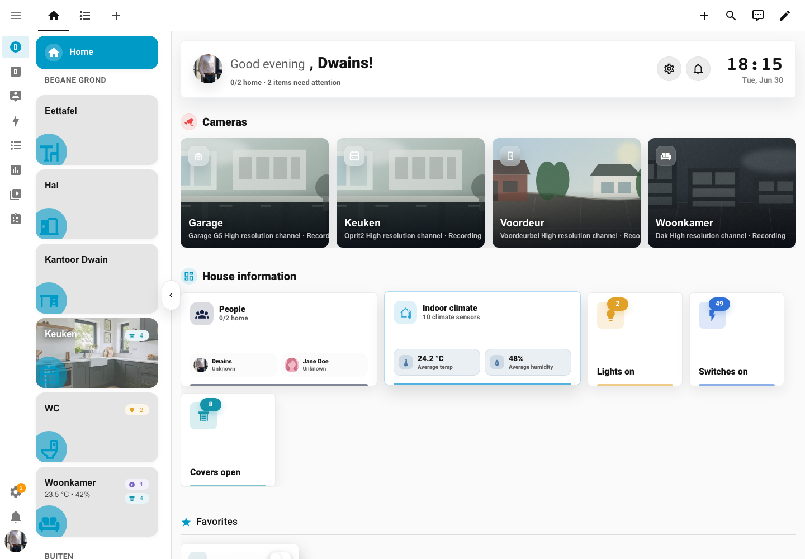
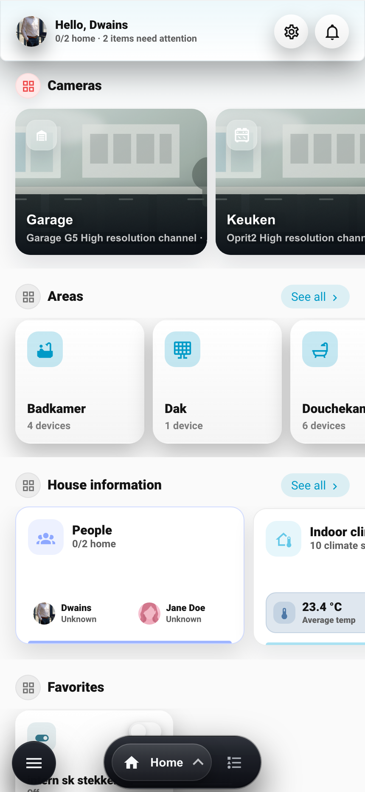
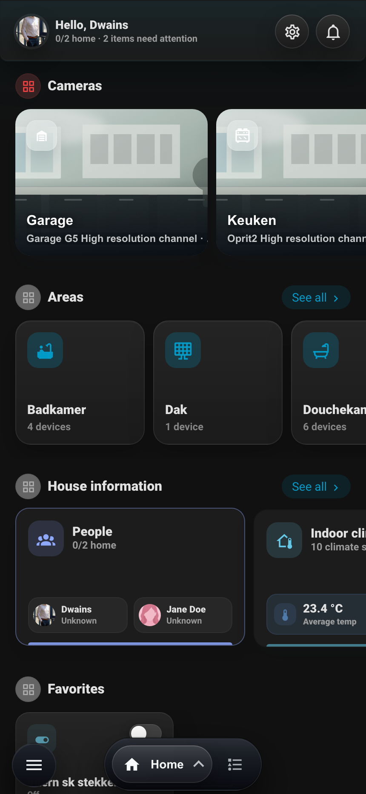

<section class="doc-hero">
  <h1>Dwains Dashboard Next</h1>
  
A fully auto-generated Home Assistant dashboard based on your areas, devices and entities. Install it, add the dashboard, and instantly get an app-like overview of your whole house.

  

    <a class="button" href="installation.html">Install with HACS</a>
    <a class="button button--secondary" href="getting-started.html">Getting started</a>
  

</section>

## Preview

  
  

    
    
  

<a href="screenshots.html">View all screenshots</a>

## Start Here

  <a class="doc-card" href="installation.html">
    <strong>Installation</strong>
    Install the dashboard through HACS and add it in Home Assistant.
  </a>
  <a class="doc-card" href="getting-started.html">
    <strong>Getting started</strong>
    Prepare areas, floors, devices and entities before using the dashboard.
  </a>
  <a class="doc-card" href="navigation.html">
    <strong>Navigation</strong>
    Understand desktop, mobile, area and device navigation.
  </a>
  <a class="doc-card" href="dashboard-settings.html">
    <strong>Dashboard settings</strong>
    Configure layout, visibility, permissions, status and support links.
  </a>

## Main Features

  <a class="doc-card" href="home-page.html">
    <strong>Home page</strong>
    Configure home sections, cameras, house information and summaries.
  </a>
  <a class="doc-card" href="areas.html">
    <strong>Areas</strong>
    Use area pages, quick controls, entity groups and custom area cards.
  </a>
  <a class="doc-card" href="devices.html">
    <strong>Devices</strong>
    Manage device groups, maintenance, people and energy views.
  </a>
  <a class="doc-card" href="blueprints.html">
    <strong>Blueprints</strong>
    Install page blueprints and replacement-card blueprints.
  </a>
  <a class="doc-card" href="custom-cards.html">
    <strong>Custom cards</strong>
    Add manual cards above, below or inside generated area sections.
  </a>
  <a class="doc-card" href="translations.html">
    <strong>Languages</strong>
    Use English, Dutch, German, French, Spanish or Chinese automatically.
  </a>
  <a class="doc-card" href="screenshots.html">
    <strong>Screenshots</strong>
    View desktop and mobile screenshots in light and dark mode.
  </a>

