# Screenshots

This page contains additional Dwains Dashboard Next screenshots. The main README only shows a few highlights so the project page stays readable.

Camera feeds in these screenshots use the privacy-safe demo images from `assets/demo-cameras`.

## Desktop

| Light mode | Dark mode |
| --- | --- |
| 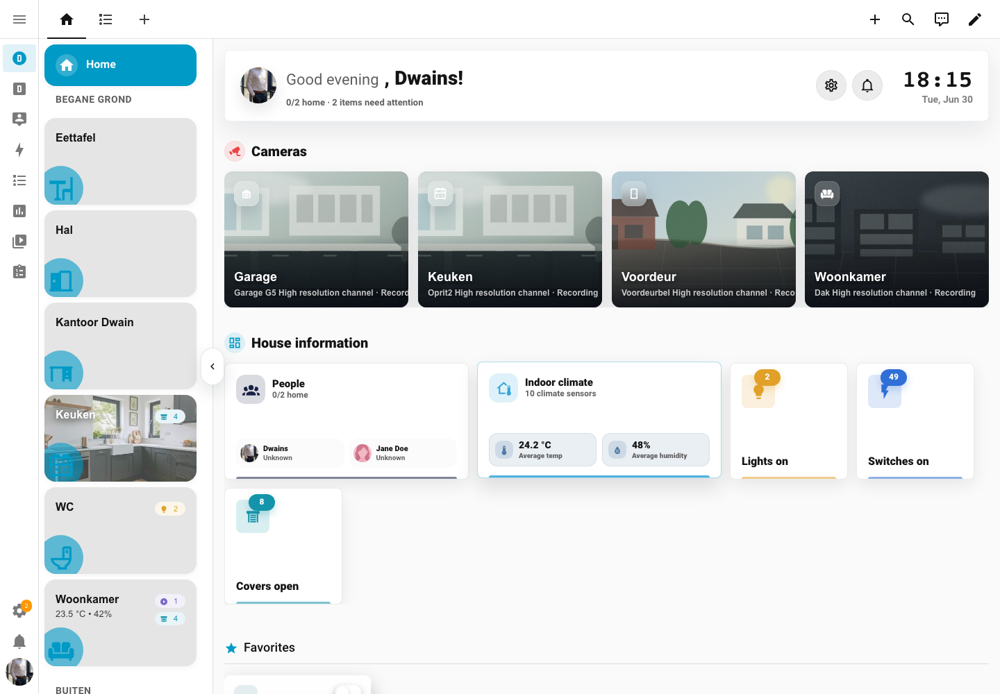 | 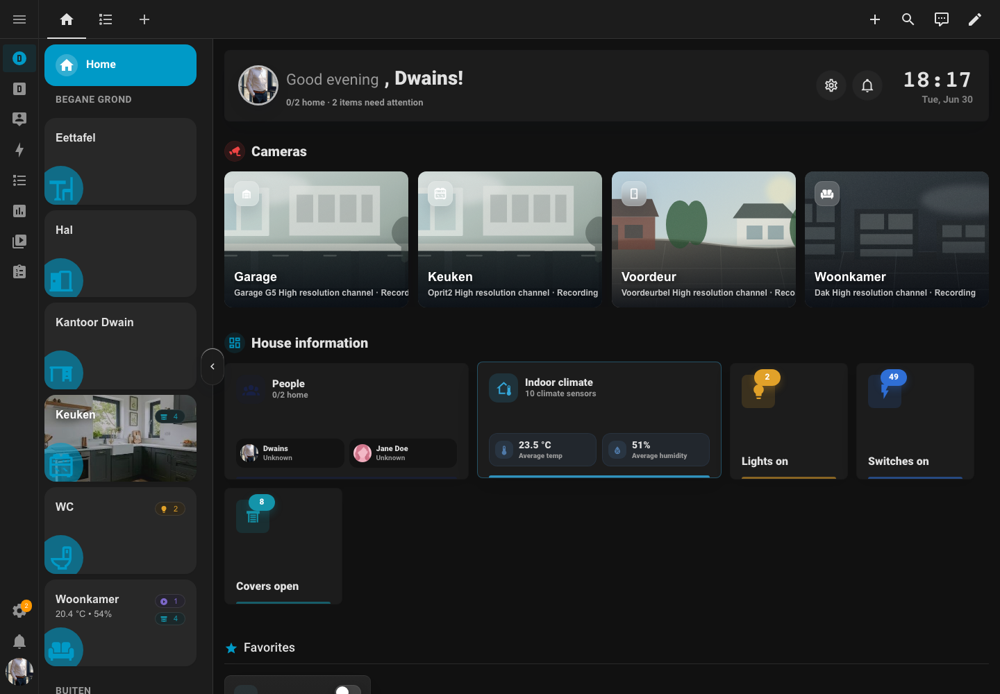 |
| 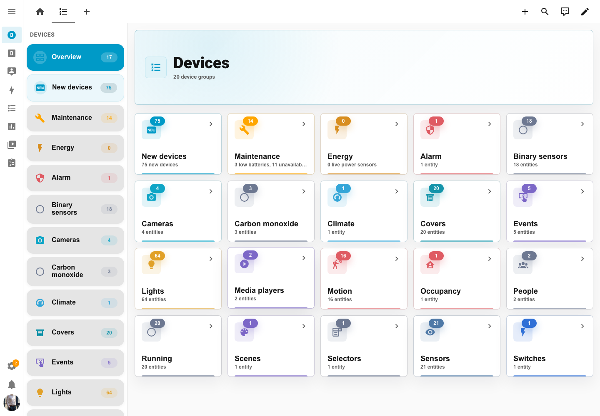 | 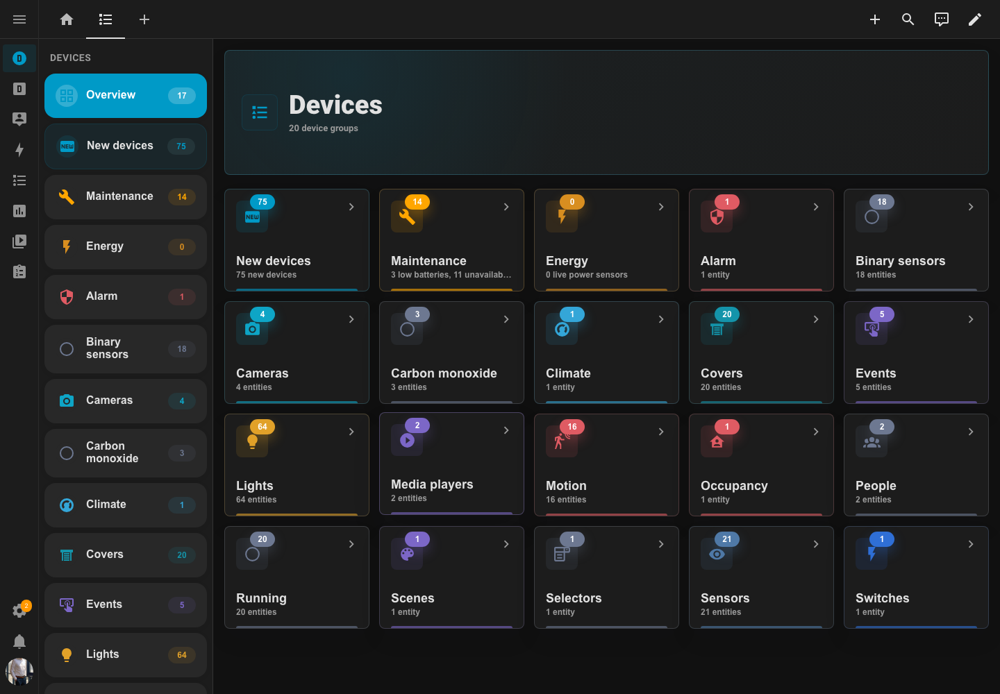 |
| 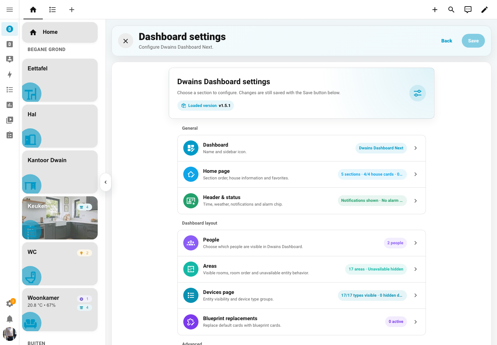 | 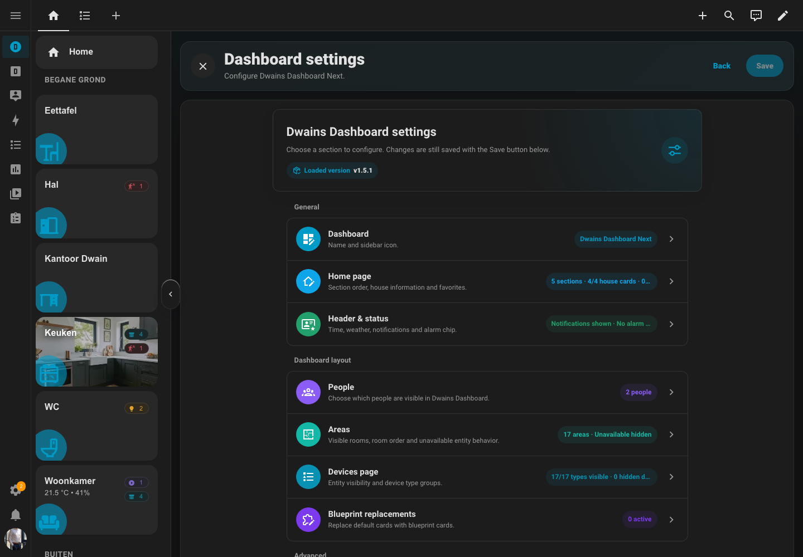 |

## Mobile

| Light mode | Dark mode |
| --- | --- |
| 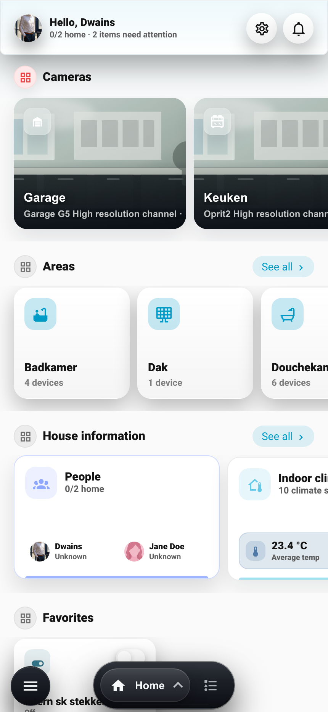 | 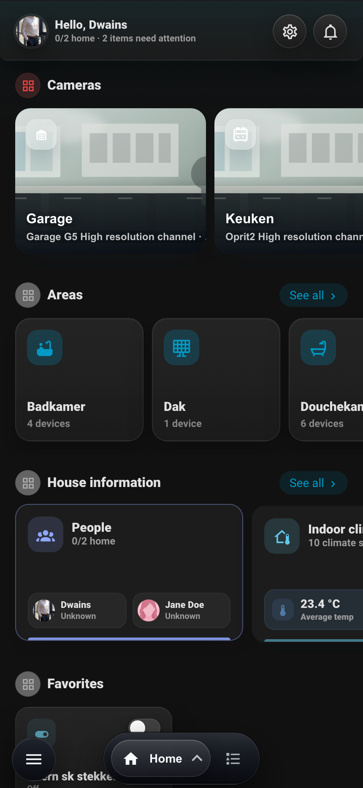 |
| 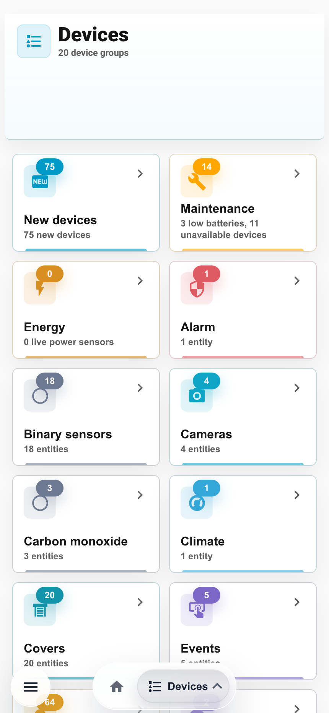 | 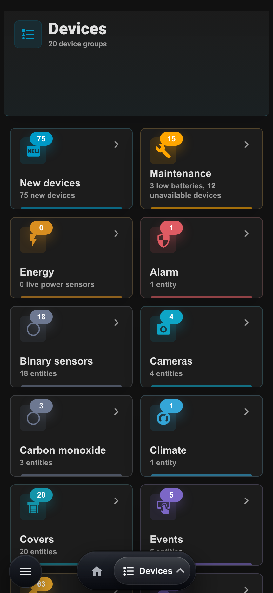 |
| 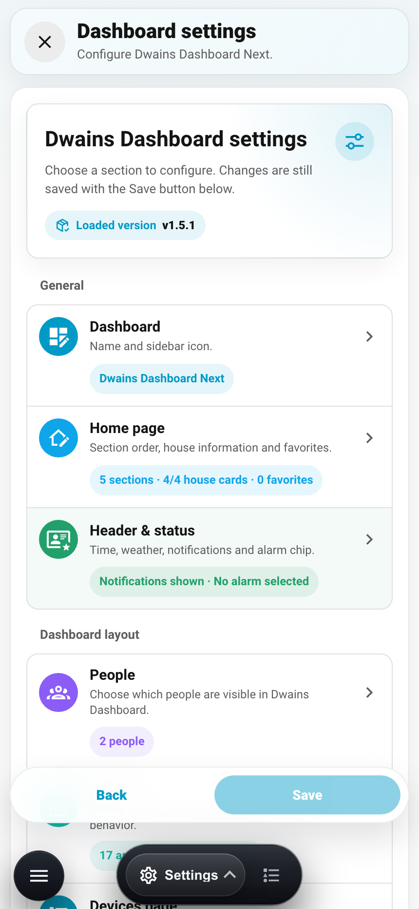 | 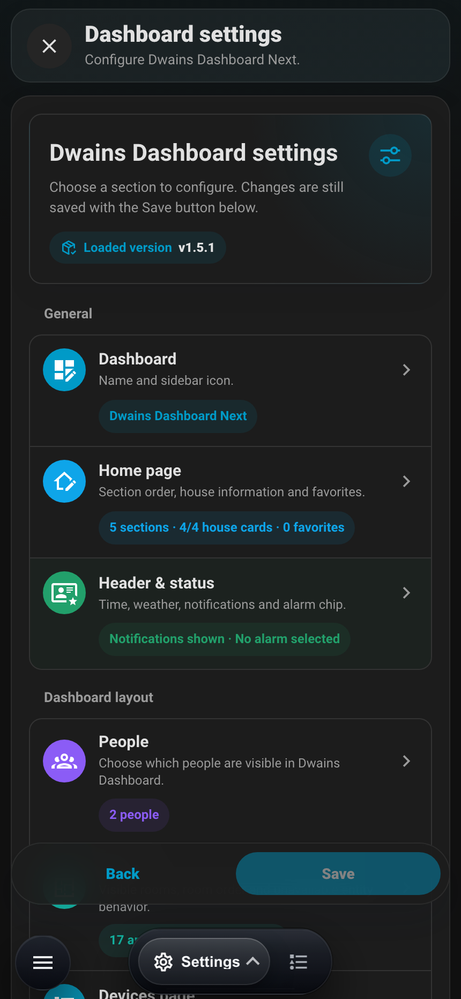 |

## Settings Details

| Page | Desktop | Mobile |
| --- | --- | --- |
| Home page | 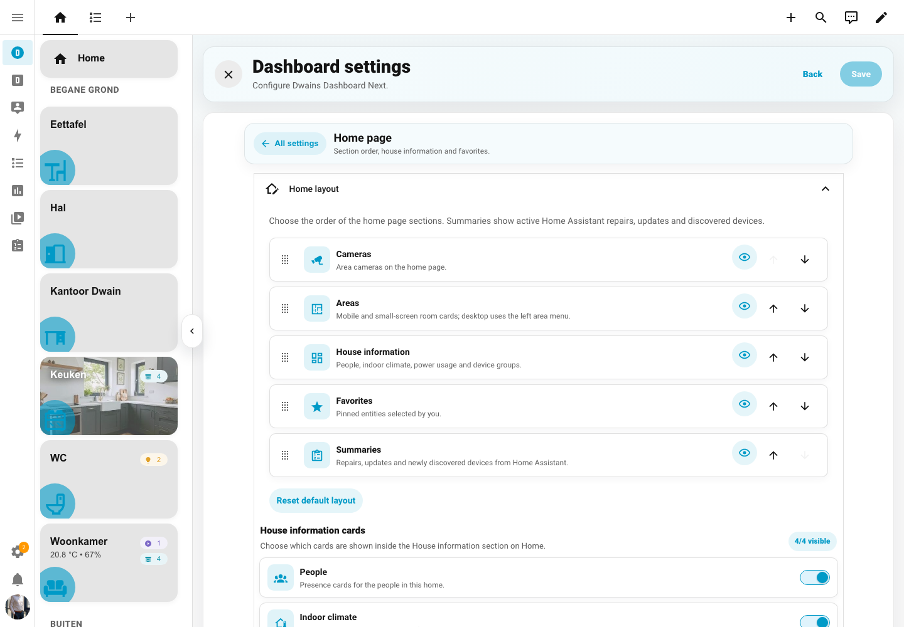 | 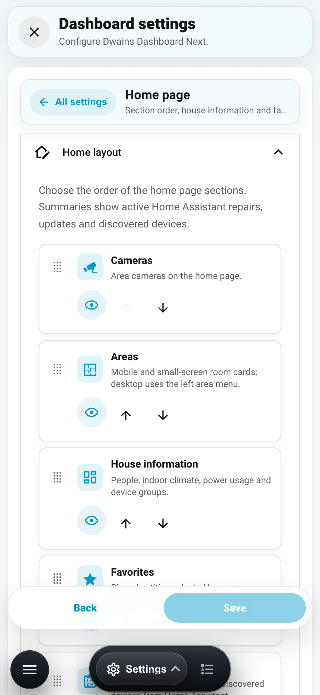 |
| Devices page | 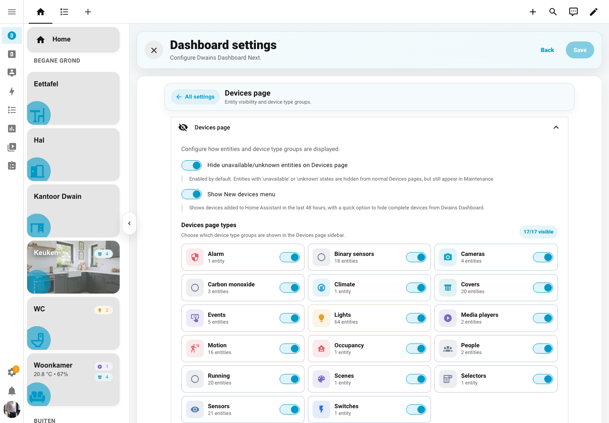 | 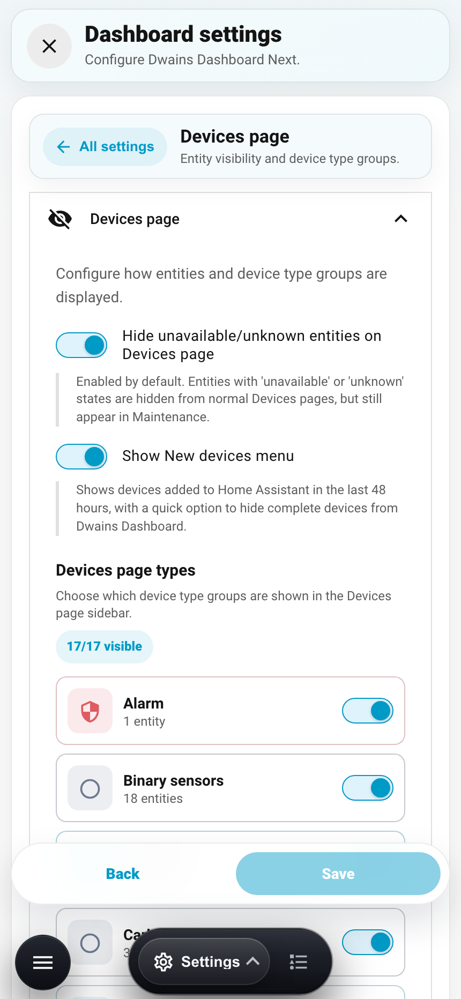 |
| Areas | 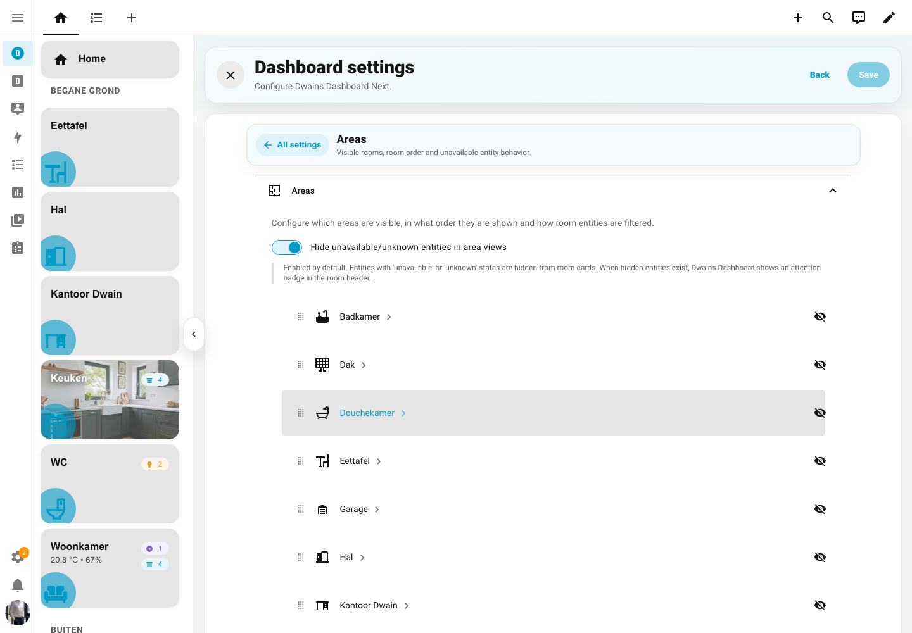 | 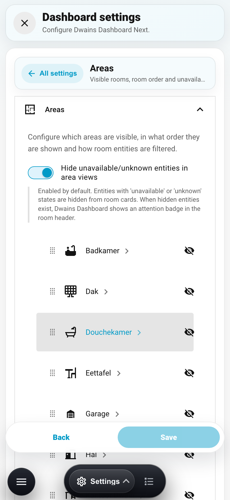 |
